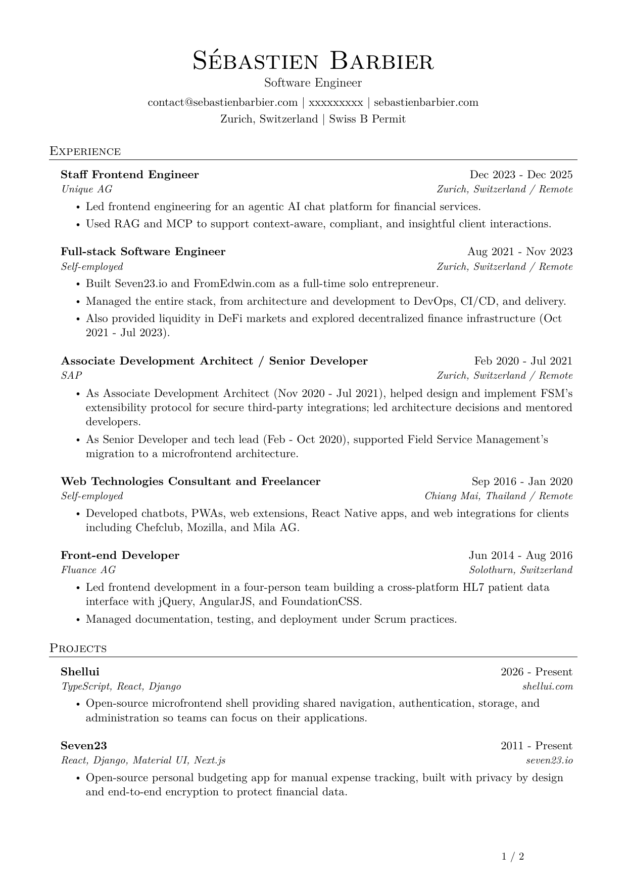
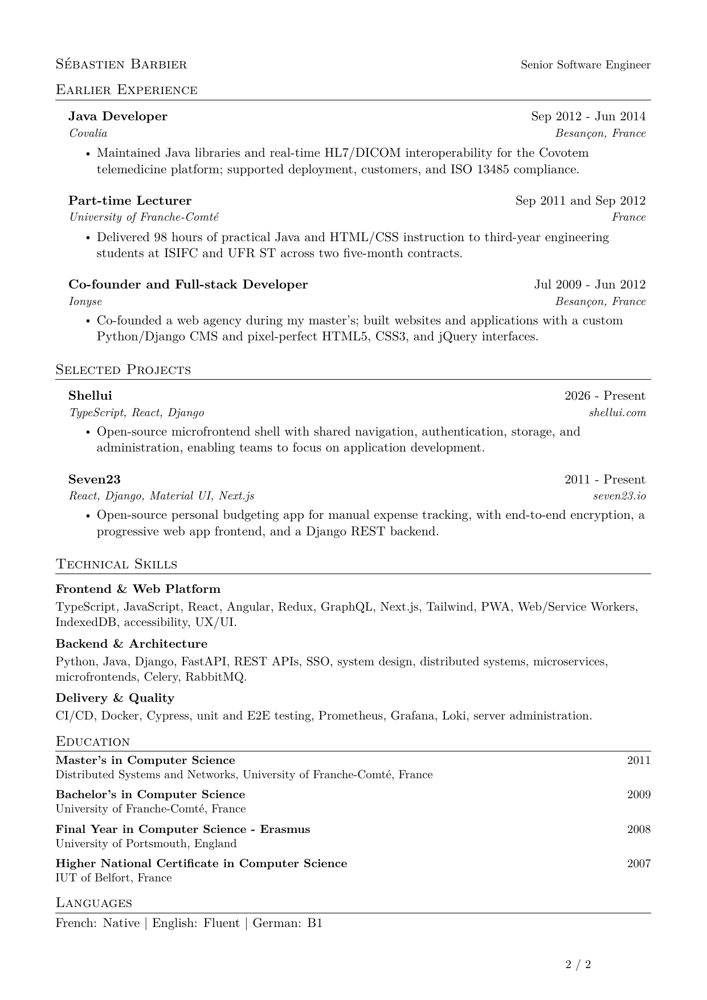
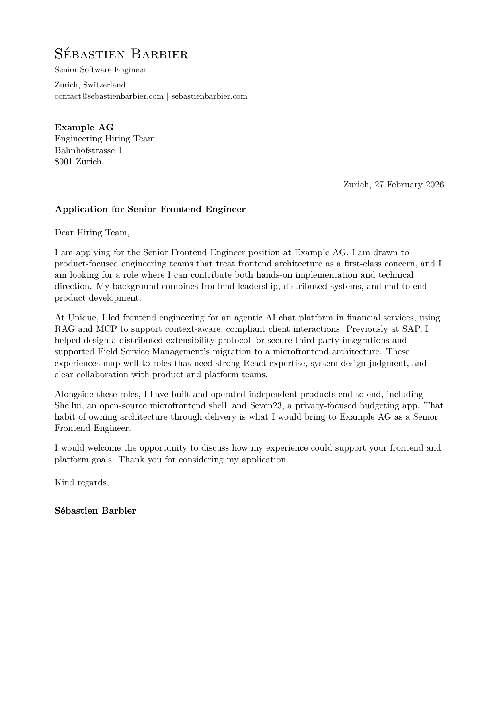

# Sébastien Barbier - Resume & Cover Letter

LaTeX source for my resume and a cover-letter template I rewrite for each job offer.

**[Resume PDF](./resume.pdf)** · **[Cover letter PDF](./cover-letter.pdf)** · [sebastienbarbier.com](https://sebastienbarbier.com) · [contact@sebastienbarbier.com](mailto:contact@sebastienbarbier.com)

---

## Preview

### Resume

<p align="center">
  <a href="./resume.pdf">
    
  </a>
</p>

<p align="center">
  <a href="./resume.pdf">
    
  </a>
</p>

### Cover letter

<p align="center">
  <a href="./cover-letter.pdf">
    
  </a>
</p>

---

## Per-application workflow

1. Edit [`resume.tex`](./resume.tex) if the role needs a different emphasis.
2. Edit the fields at the top of [`cover-letter.tex`](./cover-letter.tex) (company, role, date, greeting) and retarget the three body paragraphs.
3. Build:

```bash
make
```

That refreshes `resume.pdf` and `cover-letter.pdf`. Optional README preview images:

```bash
make previews
```

The cover letter in this repo is a **demo** (Example AG / Senior Frontend Engineer). Replace those placeholders before sending anything.

A GitHub Action ([`.github/workflows/privacy-check.yml`](./.github/workflows/privacy-check.yml)) fails the build if a phone number or street address is committed. Intentional demo placeholders go in [`.github/pii-allowlist.txt`](./.github/pii-allowlist.txt).

Run the same check locally:

```bash
bash scripts/check-pii.sh
```

Or as a **pre-commit hook** (once per clone):

```bash
git config core.hooksPath hooks
```

That points Git at [`hooks/pre-commit`](./hooks/pre-commit), which runs the privacy scan before every commit.

---

## What’s inside

| File | Role |
|------|------|
| [`resume.tex`](./resume.tex) / [`resume.pdf`](./resume.pdf) | Resume source and built PDF |
| [`cover-letter.tex`](./cover-letter.tex) / [`cover-letter.pdf`](./cover-letter.pdf) | Cover letter template and demo PDF |
| [`assets/`](./assets/) | PNG previews for GitHub |
| [`Makefile`](./Makefile) | `make`, `make resume`, `make cover-letter`, `make previews` |
| [`LICENSE`](./LICENSE) | MIT |

---

## Build

You need `pdflatex`, or [Docker](https://www.docker.com/) (uses `texlive/texlive`).

```bash
make                 # both PDFs
make resume          # resume.pdf only
make cover-letter    # cover-letter.pdf only
make previews        # refresh assets/*.png
make clean           # aux files only
```

Or compile directly:

```bash
pdflatex resume.tex && pdflatex resume.tex
pdflatex cover-letter.tex && pdflatex cover-letter.tex
```

---

## Layout notes

- **Paper:** A4. Resume uses tight margins; cover letter uses a classic letter layout that matches the resume typography.
- **Template:** Resume adapted from [Jake Gutierrez's resume](https://github.com/jakegut/resume) (MIT), inspired by [sb2nov/resume](https://github.com/sb2nov/resume).
- **PDF metadata:** Title and author set for search and ATS scanners.

Feel free to reuse the structure - keep the MIT attribution if you ship a derivative of the resume template.

---

## License

MIT © Sébastien Barbier. Resume layout adapted from [jakegut/resume](https://github.com/jakegut/resume) by Jake Gutierrez (MIT), itself based on [sb2nov/resume](https://github.com/sb2nov/resume).
